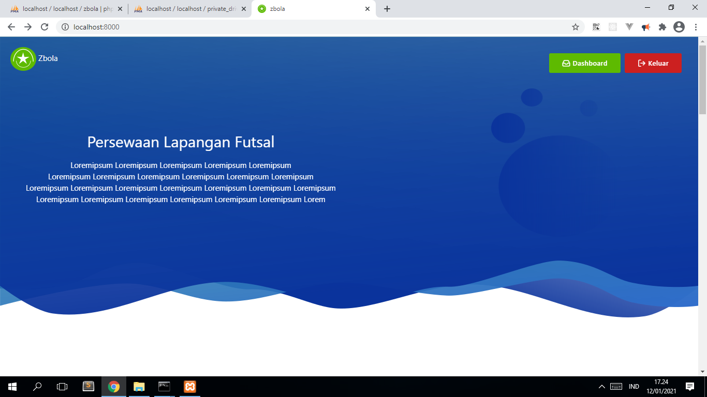
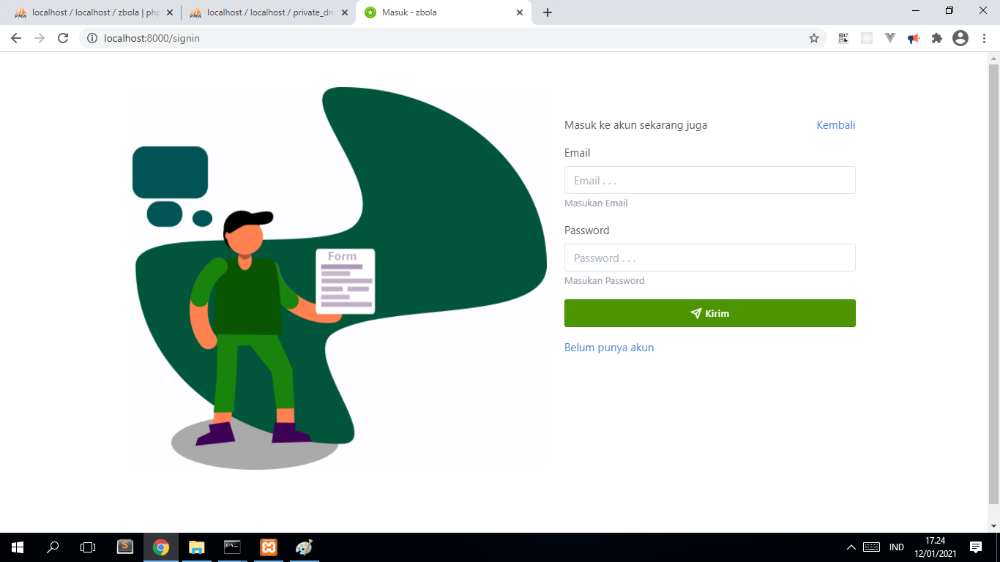
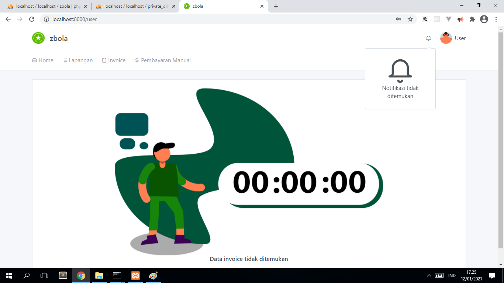
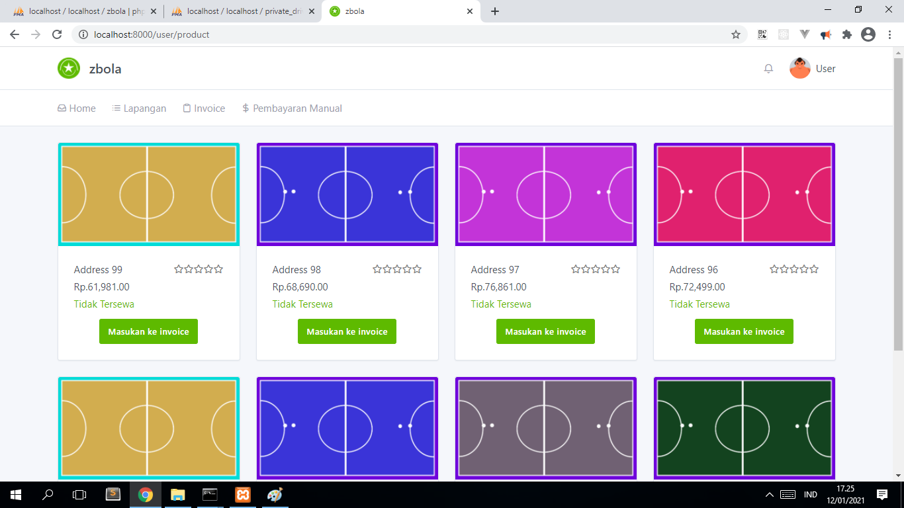
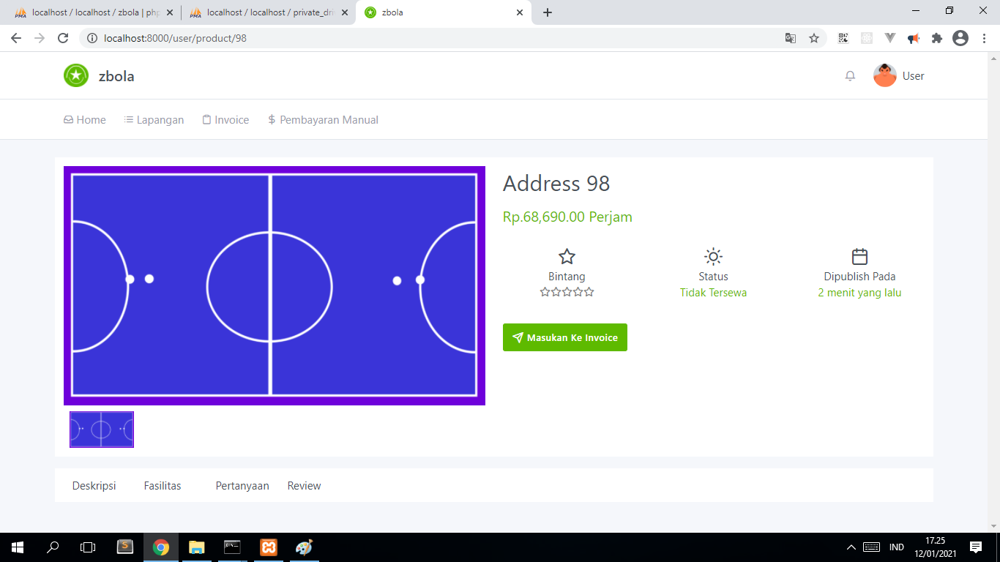
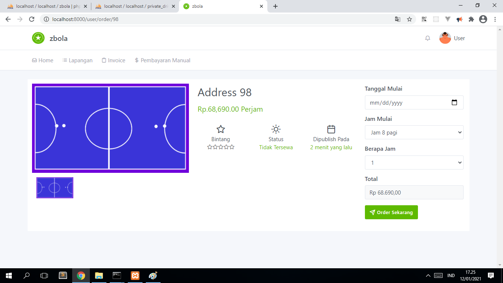

<h2> Sourcecode Pemesanan Lapangan Futsal </h2>

  Dapat digunakan sebagai bahan refrensi belajar 
  dan juga referensi untuk tugas akhir

<h4> Halaman-halaman : </h4>

 <ul>
  <li>Maintaince</li>
  <li>
    User  
    <ul>
      <li>Halaman Depan (Landing Page)</li>
      <li>Masuk (Signin)</li>
      <li>Daftar (Signup)</li>
      <li>Profil</li>    
      <li>Lapangan (Product)</li>
      <li>Detail Lapangan</li>
      <li>Order Lapangan</li>
      <li>Invoice</li>
      <li>Riwayat Invoice</li>
      <li>Notifikasi</li>
      <li>Pembayaran Manual</li>
    </ul>      
  </li>
  <li>
    Admin  
    <ul>
      <li>Kelola User</li>
      <li>Kelola Lapangan</li>
      <li>Kelola Review</li>
      <li>Kelola Invoice</li>
      <li>Kelola Pembayaran Manual</li>
      <li>Kelola Setting Website</li>
    </ul>
  </li>
 </ul>

<h4> Photo : </h4>

  
  
  
  
  
  

<h4> Requirement : </h4>

  <ul>
    <li>Php 7.2.0 ></li>
    <li>Composer 2.0.11 ></li>
    <li>Mysql</li>
    <li>Phpmyadmin (Optional)</li>
  </ul>

<h4> Langkah-langkah : </h4>

  <ul>
    <li>
      

        buat database dengan mengunakan <b>phpmyadmin/mysqli client</b>
      

    </li>
    <li>
      

        copy folder <b>public/assets/images-backup</b> 
        menjadi <b>public/assets/images</b> 
      

    </li>
    <li> 
      

        copy <b>.env.example</b> file ganti namanya dengan <b>.env</b>
      

    </li>    
    <li>  
      

        edit <b>.env</b> file   
        DB_DATABASE=<b>{DATABASE_NAME}</b>  
        DB_USERNAME=<b>{USERNAME_MYSQL}</b>  
        DB_PASSWORD=<b>{PASSWORD_MYSQL}</b>  
      

    </li>
    <li>  
      

        <b>composer install</b>
      

    </li>
    <li>    
      

        <b>php artisan migrate:fresh --seed</b>
      

    </li>
    <li>  
      

        <b>php artisan serve</b>
      

    </li>
  <ul>

<h4> Alur : </h4>

  <a href="flow/README.md">Alur</a>

<h4> Perubahan : </h5>

  <a href="change/README.md">Perubahan</a>

